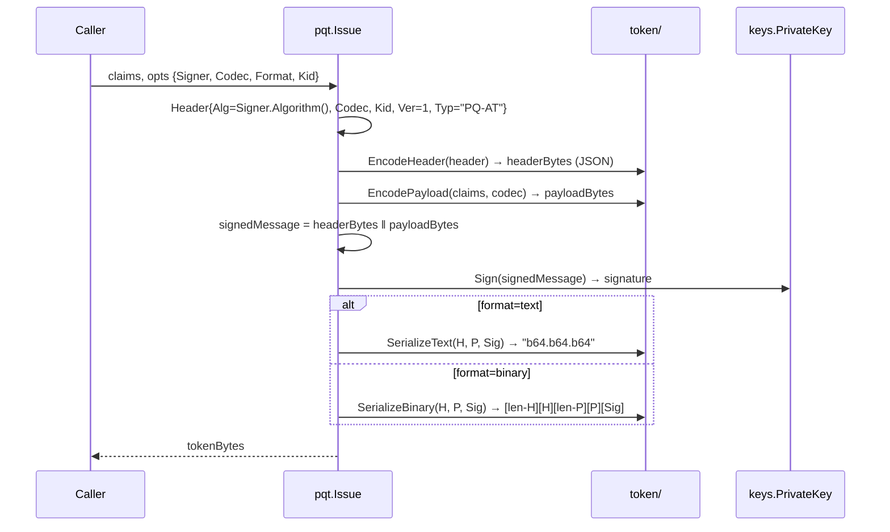
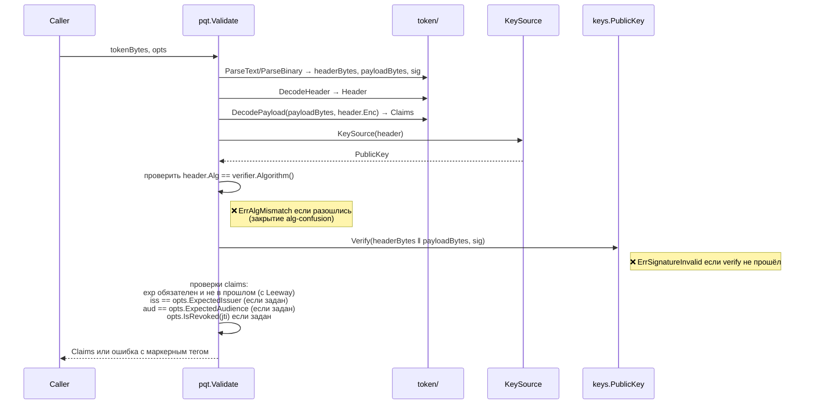
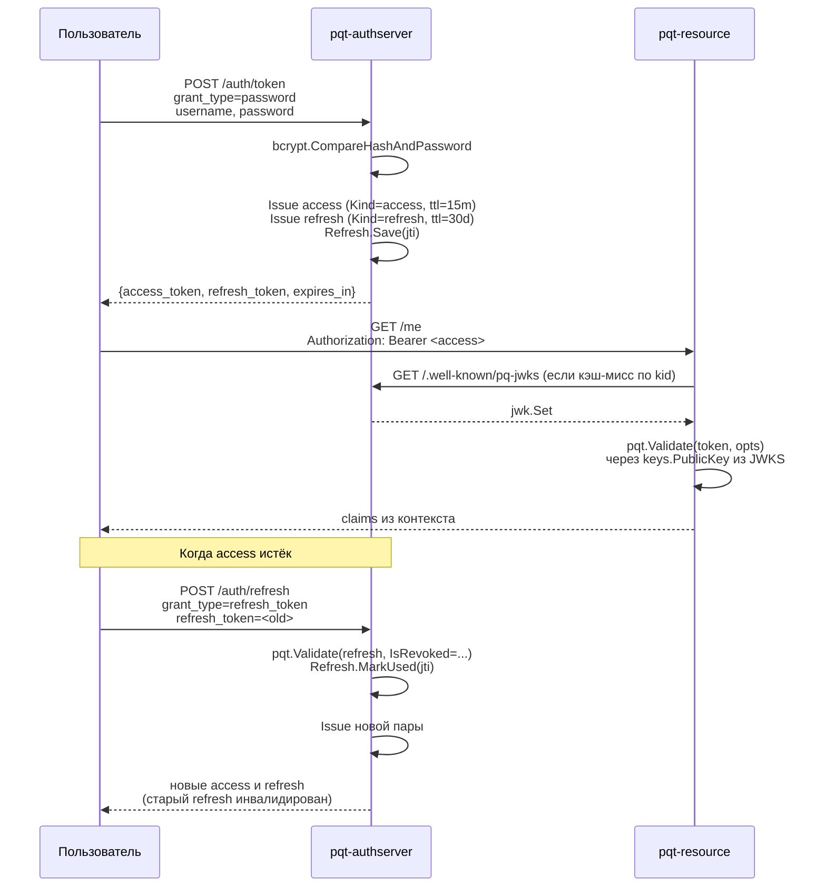

# Архитектура программного комплекса PQ-AT

Этот документ — текст-черновик для раздела 3.1 диссертации
«Построение токена постквантового доступа» (Тимофеенко С. В., ВГУ ФКН, 2026).
Описывает архитектуру прототипа, реализованного на Go в репозитории `pqt`.

## 1. Назначение системы

Прототип реализует формат **PQ-AT** (Post-Quantum Access Token), описанный
в разделе 2 диссертации, и обвязку вокруг него: сервер авторизации, сервер
ресурсов, командные утилиты, эталонный JWT для сравнения. Его задачи:

1. **Доказать жизнеспособность формата.** Все режимы подписи (`ecdsa-p256`,
   `mldsa44/65/87`, `hybrid-ecdsa-mldsa44/65/87`), оба кодека (JSON и CBOR)
   и оба формата сериализации (текстовый JWT-совместимый и компактный
   бинарный) реализованы и связаны сквозными тестами.
2. **Стенд для эксперимента главы 4.** Наборы бенчмарков и нагрузочных
   сценариев измеряют размеры токенов, скорость выпуска и проверки,
   throughput сервера под нагрузкой. Цифры ложатся в таблицы 4.2–4.6.
3. **Демонстрационный материал для защиты.** Web UI с формами выпуска,
   обновления, отзыва и декодирования токена; Swagger UI с интерактивной
   API-документацией.

Проект — прототип, не production-сервис. Сознательно опущены: персистентное
хранилище пользователей и refresh-сессий, распределённый чёрный список,
client_id/secret-аутентификация для OAuth-эндпоинтов, авторизационный
flow с redirect (используется только resource owner password credentials).
Эти упрощения обусловлены научной задачей: воспроизводимость замеров
важнее производственной комплексности.

## 2. Архитектурные принципы

### 2.1. Library-first

Корневой пакет `pqt` экспортирует API библиотеки PQ-AT (`Issue`, `Parse`,
`Validate`, опции, маркерные ошибки). Серверы и CLI — это её *клиенты*,
а не источник логики. Любой внешний сервис может использовать `pqt`
напрямую, минуя командные утилиты.

### 2.2. Разделение по слоям, а не по фичам

Каждый пакет отвечает за один слой и не знает о слоях выше. Криптослой
не знает о токенах. Слой токена не знает о подписи (получает её снаружи).
JWK-сериализация не знает о формате токена. Это даёт три преимущества:

- любой слой можно тестировать в изоляции;
- замена одного слоя (например, замена fxamacker на ugorji в CBOR-кодеке)
  не требует правок в остальных;
- при чтении кода на каждом уровне нужен только локальный контекст.

### 2.3. Минимум сторонних зависимостей

Production-код на стандартной библиотеке Go и трёх криптографических
зависимостях:

- `github.com/cloudflare/circl` — реализация ML-DSA (FIPS 204);
- `github.com/fxamacker/cbor/v2` — CBOR-кодек;
- `golang.org/x/crypto/bcrypt` — хеширование паролей в seed-пользователях.

Дополнительные зависимости подключены только для отдельных компонентов:

- `getkin/kin-openapi` — генератор OpenAPI 3.1-документа (только в
  `cmd/pqt-openapi-gen`);
- `swaggest/swgui` — встроенный Swagger UI;
- `golang-jwt/jwt/v5` — эталонный JWT для сравнения в главе 4.3
  (только в `internal/jwtbase`);
- `tsenart/vegeta/v12` — нагрузочные сценарии для главы 4.6;
- `ugorji/go/codec` — только в бенч-файле для сравнения CBOR-библиотек
  в главе 4.5.

HTTP-сервер — `net/http` стандартной библиотеки с маршрутизатором
Go 1.22 (`mux.HandleFunc("METHOD /path", ...)`). Сторонние роутеры
(chi, gorilla, gin) сознательно не используются.

### 2.4. Тестируемость на каждом слое

Юнит-тесты сопровождают каждый файл. Сквозные сценарии (e2e) поднимают
реальные сервисы через `httptest.NewServer` и проходят полный путь
от HTTP-запроса до проверки claims. Fuzz-тесты гоняют парсер форматов
и Validate миллионы итераций — без паник.

## 3. Слои системы

```
┌─────────────────────────────────────────────────────────────────────┐
│  Приложения (cmd/, internal/authserver, internal/resourceserver)    │
│  ─────────────────────────────────────────────────────────────────  │
│  pqt-cli   pqt-authserver   pqt-resource   pqt-loadtest             │
└──────────────────────────────┬──────────────────────────────────────┘
                               │
┌──────────────────────────────▼──────────────────────────────────────┐
│  Публичный API библиотеки PQ-AT (pqt/)                              │
│  Issue, Parse, Validate, IssueOptions, ValidateOptions, KeySource   │
└──────────────────────────────┬──────────────────────────────────────┘
                               │
       ┌───────────────────────┼───────────────────────┐
       │                       │                       │
┌──────▼─────────┐   ┌─────────▼────────┐   ┌──────────▼─────────────┐
│  token/        │   │  keys/           │   │  jwk/                  │
│  Header,       │   │  PrivateKey,     │   │  JWK, Set, MarshalXXX, │
│  Claims, кодеки│   │  PublicKey,      │   │  ParseXXX, Find(kid)   │
│  и форматы     │   │  ECDSA, ML-DSA,  │   │                        │
│                │   │  Hybrid          │   │                        │
└────────────────┘   └──────────────────┘   └────────────────────────┘
```

Каждый слой импортирует только нижестоящие. `token/` не знает о `keys/`;
`keys/` не знает ни о `token/`, ни о `jwk/`; `jwk/` зависит только от `keys/`.
Корневой `pqt` склеивает эти три слоя в публичный API.

### 3.1. Криптослой (`keys/`)

Файлы: `alg.go`, `signer.go`, `errors.go`, `ecdsa.go`, `mldsa.go`,
`hybrid.go`.

Главные сущности:

- **Тип `Alg`** — строковый идентификатор алгоритма из спецификации
  PQ-AT раздел 2.2. Семь значений: `ecdsa-p256`, `mldsa44/65/87`,
  `hybrid-ecdsa-mldsa44/65/87`. Метод `IsHybrid()` отличает гибридные.
- **Интерфейс `PrivateKey`** — `Sign(message) → signature`, `Public() → PublicKey`,
  `Algorithm() → Alg`. Реализуется тремя конкретными типами (ECDSA, ML-DSA, Hybrid).
- **Интерфейс `PublicKey`** — `Verify(message, signature) → error`,
  `Algorithm() → Alg`. Возвращает `nil` если подпись валидна;
  `ErrInvalidSignature` если нет; обёрнутую ошибку при структурных проблемах.

Реализации:

- **`ECDSAPrivateKey`/`ECDSAPublicKey`** — классическая ECDSA на кривой
  P-256. Сообщение хешируется SHA-256 (RFC 7515 §3.4 ES256). Подпись
  в формате ASN.1 DER (~70–72 байта).
- **`MLDSAPrivateKey`/`MLDSAPublicKey`** — ML-DSA через `cloudflare/circl`,
  параметризован уровнем безопасности (44/65/87). Подпись фиксированной
  длины по FIPS 204: 2420 / 3309 / 4627 байт.
- **`HybridPrivateKey`/`HybridPublicKey`** — композит «классическая половина
  + постквантовая половина». Подпись формата
  `[2 байта длины ECDSA, big-endian] [ECDSA-подпись] [ML-DSA-подпись]`.
  Длина классической части варьируется (ASN.1 даёт 70–72 байта), поэтому
  префикс длины обязателен — без него парсер не отделит ECDSA от ML-DSA.
  Verify запускает обе проверки **параллельно** через `errgroup`;
  для бенчмарков 4.4 оставлен метод `VerifySequential`.

### 3.2. Сериализация ключей (`jwk/`)

Файлы: `jwk.go`, `jwk_set.go`, `ec.go`, `mldsa.go`, `hybrid.go`.

Главные сущности:

- **Тип `JWK`** — единая структура с json-тегами, описывающая ключ в
  формате JSON Web Key (RFC 7517). Содержит общие поля (kty, alg, kid, use)
  и специфичные для типа: `crv/x/y/d` для EC (RFC 7518 §6.2), `pub/priv`
  для ML-DSA (расширение PQ-AT), `components` для гибрида (массив из
  двух JWK).
- **`MarshalPrivate(key)` / `MarshalPublic(key)`** — превращают
  `keys.PrivateKey` или `keys.PublicKey` в `JWK`, диспетчируя по
  конкретному типу через type switch.
- **`ParsePrivate(j)` / `ParsePublic(j)`** — обратное направление,
  диспетчируют по полю `kty`.
- **Тип `Set`** — `[]JWK` с методом `Find(kid)`. Используется на
  `/.well-known/pq-jwks` (RFC 7517 §5). Кастомный `MarshalJSON` гарантирует,
  что пустой набор сериализуется как `{"keys":[]}`, а не `{"keys":null}` —
  это снимает несовместимость со строгими JWKS-клиентами.

Расширения формата (`kty=MLDSA`, `kty=Hybrid`) не зарегистрированы в
IANA, но описаны в разделе 2 диссертации и согласованы по стилю
с CWT (RFC 8392) и каноническим JWK для EC.

### 3.3. Формат токена (`token/`)

Файлы: `header.go`, `claims.go`, `codec.go`, `codec_payload.go`,
`format.go`, `format_text.go`, `format_binary.go`, `errors.go`.

Главные сущности:

- **`Header{Alg, Ver, Typ, Enc, Kid}`** — заголовок токена. Всегда
  сериализуется в JSON со строковыми ключами (CBOR здесь не используется,
  чтобы парсер мог стартовать без внешней информации о кодировке header).
  Декодер строгий: `DisallowUnknownFields`, проверка trailing data,
  ограничение `Ver ∈ [1, CurrentVersion]`.
- **`Claims{Sub, Iss, Aud, Exp, Iat, Jti, Scope, Kind}`** — JWT-совместимые
  утверждения по RFC 7519. Поле `Kind` — расширение PQ-AT для отличия
  access от refresh; принимает значения `"access"`/`"refresh"` или пусто.
  Двойные теги: `json:"sub"` для строковых имён, `cbor:"1,keyasint"`
  для CWT-стиля (RFC 8392): 1=sub, 2=iss, 3=aud, 4=exp, 5=iat, 6=jti,
  7=scope, 8=kind.
- **`Codec`** — `json` или `cbor`. Записывается в `Header.Enc` и определяет
  кодек payload.
- **`Format`** — `text` (JWT-совместимый) или `binary` (компактный).
  Не записывается в токен, передаётся как параметр Issue/Parse.

Кодеки:

- **JSON** — стандартный `encoding/json`.
- **CBOR** — режим `CanonicalEncOptions` для байт-в-байт стабильного
  вывода (важно для подписи). Декодер строгий — `DupMapKey:
  DupMapKeyEnforcedAPF` отвергает дубликаты ключей.

Сериализаторы:

- **Текстовый** — `Base64url(H).Base64url(P).Base64url(Sig)`,
  `RawURLEncoding` без padding (RFC 7515 §2).
- **Бинарный** — `[2 байта длины H, BE][H][2 байта длины P, BE][P][подпись]`.
  Подпись пишется без префикса длины — её размер однозначно задан алгоритмом.
  Парсер `ParseBinary` возвращает срезы того же буфера, без копирования —
  это даёт zero-copy путь для бенчмарков 4.5; контракт «не меняй буфер
  до проверки подписи» зафиксирован в godoc.

Подпись над `H||P` пакет НЕ считает — он только кодирует и склеивает.
Это позволяет использовать форматы независимо от криптослоя.

### 3.4. Корневой пакет `pqt`

Файлы: `issuer.go`, `validator.go`, `options.go`, `errors.go`.

Тут крипта встречается с форматом. Три публичные функции:

- **`Issue(claims, opts) → []byte`** — собирает заголовок (алгоритм
  берётся из `opts.Signer.Algorithm()` — в опциях явного `Alg` нет,
  чтобы header не мог разойтись с ключом), сериализует claims по `opts.Codec`,
  считает подпись над `H||P`, склеивает в `opts.Format`.

- **`Parse(token, format) → header, claims, signature, signedMessage, error`**
  — разбор без проверки подписи. Полезен для отладки и для `KeySource`,
  которому нужно посмотреть на kid/alg перед выбором ключа.

- **`Validate(token, opts) → claims, error`** — полный цикл: разбор,
  выбор ключа через `KeySource`, проверка `header.Alg == verifier.Algorithm()`,
  verify подписи, валидация claims (exp, iss, aud, опционально IsRevoked).

Ключевой тип:

```go
type KeySource func(token.Header) (keys.PublicKey, error)
```

Функция-селектор. Caller передаёт нужную логику: статический ключ, поиск
в `jwk.Set` по `header.Kid`, опрос внешнего JWKS-эндпоинта. В godoc
явно указано, что `KeySource` **нельзя** реализовывать через выбор по
`header.Alg` — это поле контролируется атакующим, и selektор по нему
обнуляет защиту от alg-confusion.

### 3.5. Серверная часть

Серверная часть в `internal/` — это потребители библиотечного API.

- **`internal/authserver/`** — выпуск access + refresh, ротация, отзыв,
  публикация JWKS, OAuth metadata, pprof.
  Файлы: `config.go`, `users.go`, `keystore.go`, `refresh_store.go`,
  `revocation_store.go`, `server.go`, `handlers.go`, `discovery.go`,
  `webui.go`, `webui/`.
- **`internal/resourceserver/`** — middleware-валидация Bearer-токена,
  публичные хелперы `RequireValidToken`, `RequireScope`, `ClaimsFromContext`.
  Файлы: `config.go`, `jwks_client.go`, `middleware.go`, `server.go`.
- **`internal/jwtbase/`** — эталонный JWT через `golang-jwt/jwt/v5` для
  главы 4.3. Один файл.
- **`internal/openapi/`** — code-first генератор OpenAPI 3.1-документа
  через `getkin/kin-openapi`.
- **`internal/bench/`** — сравнительные бенчмарки и нагрузочные smoke-тесты.

Бинарники в `cmd/`: `pqt-cli`, `pqt-authserver`, `pqt-resource`,
`pqt-openapi-gen`, `pqt-loadtest`. Каждый — wiring + работа с конфигом
из env, сама логика всегда в `internal/`.

## 4. Поток выпуска токена (Issue)



Алгоритм определяется одним местом — `Signer.Algorithm()`. Pretty-print
заголовка перед подписью невозможен: `Header.Alg` подставляется в код
из ключа, и вызывающий не может его перенастроить через опции.

## 5. Поток проверки токена (Validate)



Порядок принципиален: alg-mismatch проверяется **до** verify подписи.
Без этой проверки можно было бы реализовать `KeySource`, выбирающий
ключ по `header.Alg`, и атакующий, поменявший `alg`, заставил бы
сервер взять «слабый» ключ.

## 6. Поток в работающей системе

Полный сквозной сценарий «логин → защищённый запрос»:



JWKS-клиент в resource-сервере держит кэш по `kid`. На cache-miss
он сам запрашивает свежий JWKS у auth-сервера — это покрывает ротацию
ключей без явной инвалидации кэша на стороне resource.

## 7. Принципиальные архитектурные решения

### 7.1. Пакеты по слоям, а не плоский корень

В первоначальном плане (раздел 2 `docs/plan.md`) предполагался layout
в стиле `golang-jwt/jwt/v5`: всё в корне модуля одним пакетом.
По мере роста функциональности оказалось, что слои действительно
разные: криптопримитивы (`keys/`) не зависят от формата токена, и
когда они в одном пакете — сложнее тестировать в изоляции и понимать
ответственности.

Текущий layout — пакеты по слоям, как в `crypto/tls`, `crypto/ecdsa`,
`net/http`. Каждый пакет имеет одну ответственность и стабильный
публичный API. Корневой `pqt` экспортирует тонкий слой связи между
криптослоем и форматом — это публичный API библиотеки.

### 7.2. Алгоритм берётся из `Signer.Algorithm()`, не из опций

Поле `IssueOptions.Alg` сознательно отсутствует. Алгоритм единственным
способом задаётся через `opts.Signer` (точнее — через его метод
`Algorithm()`), и именно он попадает в `header.alg`. Это исключает
сценарий, в котором `header.alg` расходится с ключом, которым токен
действительно подписан.

### 7.3. `KeySource` как функция, а не интерфейс

`type KeySource func(token.Header) (keys.PublicKey, error)` — это
идиома стандартной библиотеки Go (см. `crypto/tls.Config.GetCertificate`).
Любая логика выбора ключа реализуется обычной функцией без
дополнительного типа. Если когда-нибудь понадобится stateful-резолвер,
его можно завернуть в method value (`(*Resolver).Resolve`).

### 7.4. `Kind` в claims вместо отдельного типа

Access и refresh — это **тот же** PQ-AT-токен, отличающийся только
полем `kind` и временем жизни. Спецификация PQ-AT описана в
терминах одного формата; разделять структуру `Claims` на две
сломало бы это единство. По полю `kind` сервер отличает access от
refresh при отзыве и при проверке refresh в `/auth/refresh`.

### 7.5. bcrypt-cost при dummy-хеше — равный production

Anti-probing-защита в `UserStore.Authenticate` прогоняет bcrypt-сравнение
даже при отсутствии запрашиваемого логина — иначе по времени отклика
видно, существует ли учётка. Чтобы это работало, dummy-хеш генерируется
при старте сервера с тем же `bcryptCost`, что и реальные хеши seed-юзеров.
Захардкоженный dummy с фиксированным cost (как было в первой версии
после ревью этапа 7) даёт timing-разницу в 100× при production-cost=10.

### 7.6. JWKS-клиент с cache-miss-refresh

Resource-сервер при стартe однократно скачивает JWKS, потом держит
кэш по `kid`. Если приходит токен с неизвестным `kid` — клиент
немедленно делает повторный fetch JWKS и пробует ещё раз. Это
покрывает ротацию ключей без отдельного механизма инвалидации
кэша: новый kid появляется в публикации auth-сервера, и первый же
токен под ним прозрачно потянет свежий набор.

### 7.7. Отзыв решается по `claim.Kind`, не по `token_type_hint`

`POST /auth/revoke` (RFC 7009) принимает `token_type_hint`, но
сервер использует его только в случае пустого `claim.kind` (для
совместимости со старыми токенами). Иначе атакующий мог бы
прислать чужой access-токен с `hint=refresh_token`, и сервер
ошибочно искал бы его в refresh-сессиях, не блэклистя access.

### 7.8. Web UI на vanilla JavaScript

Демо-страница в `internal/authserver/webui/` написана без фреймворков
и сборщиков. Цели: страница должна открываться сразу после
`go build`, без npm/webpack-цепочки; демонстрация на защите не
зависит от состояния каких-либо node-модулей; в репозиторий
коммитится конечный артефакт, не процесс сборки.

## 8. Безопасные дефолты

| Защита | Реализация |
|---|---|
| alg-confusion | проверка `header.Alg == verifier.Algorithm()` ДО verify подписи |
| `alg=none` в JWT | `WithValidMethods(["ES256"])` в `internal/jwtbase` |
| дубликаты CBOR-ключей | `DupMapKey: DupMapKeyEnforcedAPF` в декодере payload |
| лишние поля в Header | `DisallowUnknownFields` в `DecodeHeader` |
| trailing data в Header | проверка `dec.More()` после декода JSON |
| версионирование | `Header.Ver` ограничен `[1, CurrentVersion]` |
| вечный токен | `Validate` отвергает claims без `exp` (`exp == 0`) |
| timing-probing на логине | dummy bcrypt-сравнение при отсутствующем юзере, тот же cost |
| подсказка типа в revoke | приоритет у `claim.Kind`, hint только при пустом Kind |
| memory exhaustion | `http.MaxBytesReader` (64 КБ) на телах /auth/* запросов |
| pprof в проде | эндпоинты `/debug/pprof/*` доступны только при `--debug`/`PQT_DEBUG=1` |
| автоиндекс embed-статики | белый список файлов вместо `http.FileServer` |
| `Cache-Control` | `no-cache` на index.html, ограниченные TTL на static/openapi |
| `X-Content-Type-Options` | `nosniff` на всю статику |
| права файлов | 0o600 на ключи и токены, 0o700 на директорию ключей |

## 9. Точки расширения

Прототип не закрывает следующие сценарии — они вынесены за рамки
диссертационной работы, но архитектурно поддерживаются.

- **Персистентный чёрный список.** `RevocationStore` сейчас in-memory.
  Для production-сценария он становится интерфейсом с реализацией
  поверх Redis или базы — изменение локально в `internal/authserver`,
  публичный API не трогается.
- **Реальная ротация ключей.** `KeyStore.LoadOrInit` читает
  `*.priv.jwk.json` из директории; чтобы добавить ротацию по cron,
  достаточно периодического `os.ReadDir` и обновления `keys` map
  с новым `defaultKid`. JWKS-клиент resource-сервера уже умеет
  подхватывать новый kid (см. 7.6).
- **Дополнительные алгоритмы.** Falcon, SLH-DSA или другие постквантовые
  схемы из FIPS 205+ добавляются как новые `keys.Alg`-константы и
  новые реализации `keys.PrivateKey`/`PublicKey`. Гибридный композит
  параметризован — для нового PQ-алгоритма достаточно расширить
  `combineHybridAlg`.
- **Authorization code flow.** Текущая реализация поддерживает только
  `grant_type=password`; добавление полноценного flow требует ещё
  одного эндпоинта `/auth/authorize` и хранилища авторизационных кодов.
  В существующих маршрутах конфликта нет.
- **HSM-бэкенд для приватных ключей.** Интерфейс `keys.PrivateKey`
  абстрактный; реализация поверх PKCS#11/HSM подключается без
  изменений в коде серверов.

## 10. Краткое резюме

Прототип PQ-AT построен как Go-библиотека с тремя слоями (криптография,
сериализация ключей, формат токена) и тонким публичным API над ними.
Серверная часть, командные утилиты и эталон JWT — это потребители
библиотеки. Архитектура сознательно простая: стандартная библиотека
Go, минимум сторонних зависимостей, идиоматичные паттерны (KeySource
как функция, опции через структуру, маркерные ошибки через `errors.Is`).

Безопасность достигается набором дефолтов, выбранных при ревью каждого
этапа: проверка алгоритма до verify, обязательный exp, строгий CBOR-декодер,
закрытое множество полей в header, anti-probing на логине. Отступления
от плана (пакеты по слоям, а не плоский корень; дубль `openapi.yaml`
для embed; vanilla-JS UI вместо описанного «webui/») зафиксированы в
этом документе и не нарушают цели диссертации.
